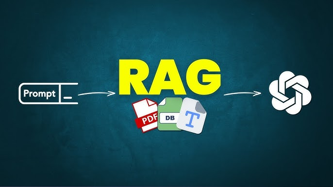
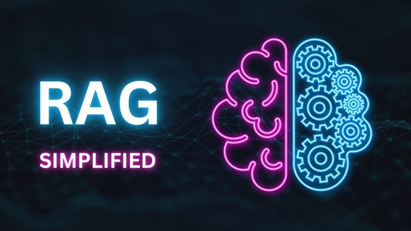
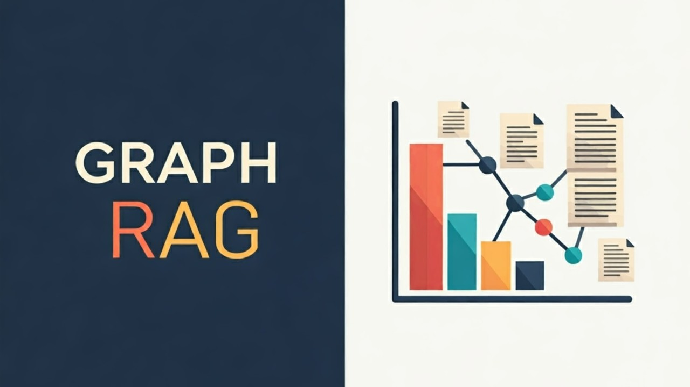
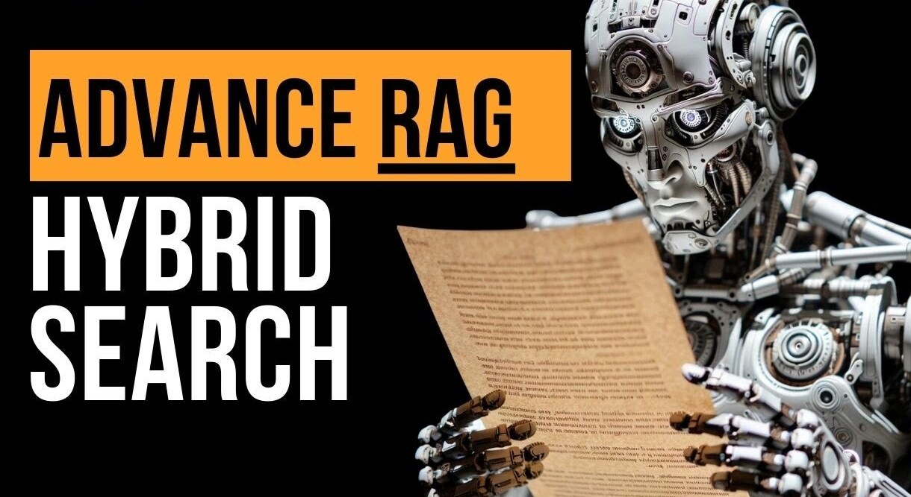
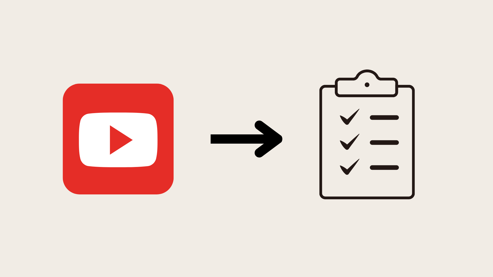

# Objective

I started this repository as a part of my journey to learn about Generative AI. 
Here, I implement my learnings and build some cool stuffs around the same.
I am entirely new to this and just started my journey in the field of AI.
This time I desire to learn and share in public.
The only objective is to share my journey and to learn from other talented and experienced people out there.

This repository contains streamlit powered AI apps to demonstrate various concepts in the field of Generative AI. 
You can access the UI interface [here](https://learn-ai.streamlit.app/).   

---

# List of Apps

### [1. Simple RAG](https://learn-ai.streamlit.app/Simple_RAG)

One of the most common use cases of Generative AI is RAG (Retrieval Augmented Generation). 
RAG applications are tools that combine AI language models with real-world information sources to give better answers. 
They use a “retrieval” step to fetch facts or data from documents, websites, or databases and then “generate” answers using AI. 
This makes them more accurate and up-to-date compared to regular AI models that rely only on training data. 
RAG is great for tasks like answering questions, summarizing documents, or helping with research. 
It bridges the gap between advanced AI and real-time, fact-based knowledge.

 

### [2. Demystify RAG](https://learn-ai.streamlit.app/Demystify_RAG)

This app gives you a visual representation of how RAG works.
It takes you to the tour of entire steps involved in RAG.
It begins with uploading documents, which are then divided into smaller chunks and indexed using embeddings for efficient retrieval.
When a query is received, the system performs a similarity search to fetch the most relevant information. 
These retrieved chunks are passed to a generative AI model to create accurate, context-aware responses.

 

### [3. Graph RAG](https://learn-ai.streamlit.app/Graph_RAG)

Graph RAG organizes data as nodes and edges in a graph, capturing relationships between concepts. 
This enables more context-aware and accurate responses compared to traditional RAG. 
It is ideal for tasks like complex reasoning, exploring knowledge connections, or semantic research. 
Graph RAG bridges the gap between relational data and AI-driven, knowledge-based insights.

 

### [4. Hybrid Search RAG](https://learn-ai.streamlit.app/Hybrid_Search_RAG)

Hybrid Search RAG combines lexical search methods like BM25 with semantic search using embeddings. 
This enables both precise keyword matching and deeper understanding of query intent. 
It is ideal for tasks like multi-faceted search, document retrieval, or AI-driven assistance. 
Hybrid Search RAG bridges the gap between traditional search techniques and modern semantic capabilities.

 

### [5. Contextual Retrieval RAG](https://learn-ai.streamlit.app/Contextual_Retrieval_RAG)

Contextual retrieval enhances traditional RAG by addressing the issue of insufficient context in individual document chunks.
Instead of treating chunks as isolated units, it prepends chunk-specific explanatory context to enrich their meaning.
This approach bridges the gap between granular document splitting and the need for meaningful context in retrieval.

 

### [6. Financial Analyst Agent](https://learn-ai.streamlit.app/Financial_Analyst_Agent)

The AI powered financial analyst agent designed to provide insightful and concise analysis to help you make informed financial decisions. 
Main functions include retrieving and analyzing financial data such as stock prices, historical data, and market trends.
It uses Yahoo Finance API tools to fetch the data and OpenAI API to generate the insights.
It aims to empower you with clear, actionable insights to navigate the financial landscape effectively.
Users should conduct their own research or consult a financial advisor before making decisions.

 

### [6. Data Query Agent](https://learn-ai.streamlit.app/Data_Query_Agent)

This agent connects natural language queries with data visualization, enabling users to explore datasets effortlessly. 
Users can upload a SQLite database or a CSV file and ask questions about their data using natural language. 
The agent translates these questions into SQL queries, executes them on the database, and presents the results as clear and insightful visualizations.

 

### [7. Youtube Video Summarizer](https://learn-ai.streamlit.app/Youtube_Video_Summarizer)

This agent summarizes YouTube videos using AI-powered natural language processing. 
Users can input the URL of a YouTube video, and the agent will generate a concise summary of the video's content. 
The agent uses a combination of video analysis and text summarization to provide a detailed overview of the video. 
It is a powerful tool for extracting key information from videos and saving time for users.

 

### [8. ShopWise Agent](https://learn-ai.streamlit.app/ShopWise_Agent)

ShopWise Agent revolutionizes the online shopping experience with the power of agentic AI. 
Whether users have expertise in the product’s field or not, ShopWise Agent helps them discover the best-suited products tailored to their unique needs and preferences. 
By offering intelligent recommendations and decisive insights, it empowers customers to make informed choices and enjoy a seamless shopping experience.

---

# Note

I will be continuously adding the new apps for different concepts and keep on improving the existing apps with time.
