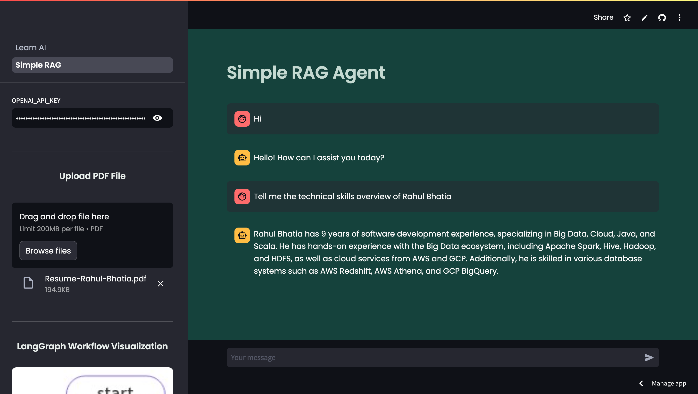
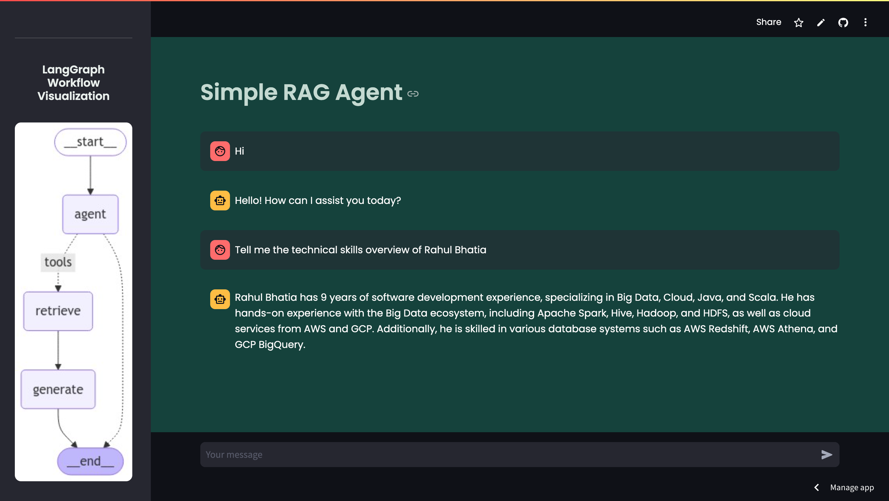

# Objective

I started this repository as a part of my journey to learn about Generative AI. 
Here, I implement my learnings and build some cool stuffs around the same.
I am entirely new to this and just started my journey in the field of AI.
This time I desire to learn and share in public.
The only objective is to share my journey and to learn from other talented and experienced people out there.

This repository contains streamlit powered AI apps to demonstrate various concepts in the field of Generative AI. 
You can access the UI interface [here](https://learn-ai.streamlit.app/).   

---

# List of Apps

### 1. Simple RAG
 

---

## 1. Simple RAG

One of the most common use cases of Generative AI is RAG (Retrieval Augmented Generation). 
RAG applications are tools that combine AI language models with real-world information sources to give better answers. 
They use a “retrieval” step to fetch facts or data from documents, websites, or databases and then “generate” answers using AI. 
This makes them more accurate and up-to-date compared to regular AI models that rely only on training data. 
RAG is great for tasks like answering questions, summarizing documents, or helping with research. 
It bridges the gap between advanced AI and real-time, fact-based knowledge.

You can learn more about RAG with the help of below video by [Underfitted](https://www.youtube.com/@underfitted):

  

### Tech Stack

* [LangGraph](https://www.langchain.com/langgraph) - To define the agentic flow of the application
* [OpenAI API](https://openai.com/api/) - To interact with the OpenAI provided LLM models
* [Streamlit](https://streamlit.io/) - For the chat UI interface powered by python

### How to use

* Visit the link: [Simple RAG](https://learn-ai.streamlit.app/Simple_RAG)
* The default OpenAI API key is provided to the application but if its not working then users need to input their own OpenAI API key. You can create one [here](https://platform.openai.com/settings/organization/api-keys).
* Upload any readable PDF file
* Ask questions from the document using chat interface

 

  

User can also view the langgraph workflow defined for the application on the left sidebar that is rendered during the runtime.

 

---

# Note

I will be continuously adding the new apps for different concepts and keep on improving the existing apps with time.
